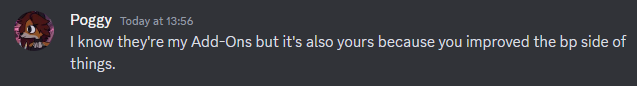
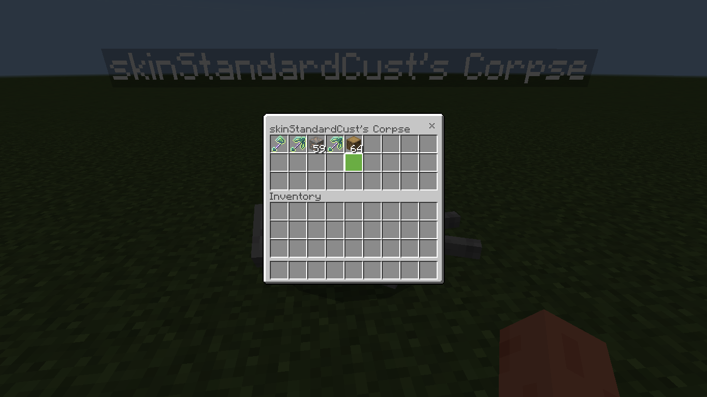
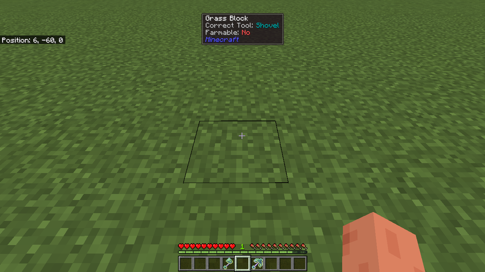

# Portfolio
## Content
### Better on Bedrock
- Download: [MCPEDL](https://mcpedl.com/better-on-bedrock/)

### Better Tools
Adds a set of overpowered tools to Minecraft that do different things.
Made for fun and still not done.
- Showcase:
  - https://youtu.be/cIfr9nSEj_Q
  - https://youtu.be/5SBAQ2GoRag
- Download: [GitHub](https://github.com/DarkGamerYT/portfolio/releases/download/Initial/Better.Tools-v1.0.0.mcaddon)

### Teleporters
Inspied by the Java mod OpenBlocks Elevator.
Jump to go up, or crouch to go down. Note, another teleporter has to be placed in the direction you to go.
- Showcase: https://youtu.be/14ZybxeMB6s
- Download: [GitHub](https://github.com/DarkGamerYT/portfolio/releases/download/Initial/Teleporters-v1.0.0.mcaddon)

### Better First Person
Made for fun to experiment with the /camera command when it was first added.
- Showcase: https://youtu.be/AqafbwWjeT8

---

### Player Corpse
- Download: [MCPEDL](https://mcpedl.com/player-corpse/)

### Wawla (What are we looking at)
- Download: [MCPEDL](https://mcpedl.com/poggys-whats-that-tooltip-add-on/)

## Programming
### [Bedrock Tools](https://github.com/DarkGamerYT/Bedrock-Tools)

### [OreUI Viewer](https://github.com/DarkGamerYT/OreUI-Viewer)

